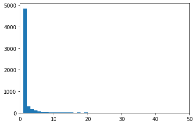
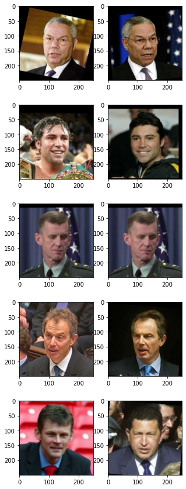
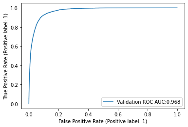
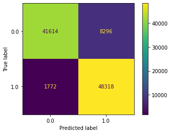
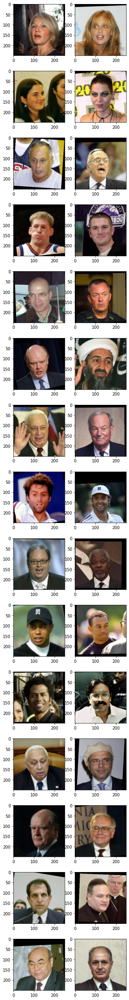

# Face recognition

Juan Camilo Azuero

## Introduction

This notebook is part of the final project of the course Introduction to Deep Learning from the University of Colorado Boulder. The goal of the project is to create a face recognition application that is capable of recognizing someone based on a couple of pictures. There are many models deployed with such capabilities powering applications like the face id unlock feature some cellphones have.   

## Imports and setup


```python
import numpy as np
import pandas as pd
import matplotlib.pyplot as plt
import tensorflow as tf
from tensorflow import keras
import os
from matplotlib.image import imread
from sklearn.metrics import roc_auc_score, RocCurveDisplay, ConfusionMatrixDisplay
```


```python
%load_ext nb_black
```


 


```python
FACES_DIR = "/../Data/Faces"
FACES_CSV = "/../Data/faces_dir.csv"
```


 


## Exploratory Data Analysis

This project is based on the Kaggle dataset <a href="https://www.kaggle.com/datasets/quadeer15sh/lfw-facial-recognition">LFW - Facial Recognition</a> that contains 13,233 labelled pictures of 5,749 distinct famous people. The pictures are stored in .jpg format and all of them have a size of (250, 250, 3) including the RGB channels. This dataset has high bias and should not be used for any commercial purpose as stated in Kaggle, but it will serve to create a demo of the face pairing model. 

First, let's create a pandas dataframe with information about the diferent pictures in the dataset.


```python
CWD = os.getcwd()
```


 


```python
def create_faces_dir(faces_url: str, faces_csv: str):
    """Creates dir of labelled images of faces"""
    faces = os.listdir(CWD + faces_url)
    faces_df = pd.DataFrame(columns=["address"], data=faces)
    faces_df["number"] = faces_df["address"].apply(
        lambda x: int(x.split("_")[-1].split(".")[0])
    )
    faces_df["name"] = faces_df["address"].apply(lambda x: " ".join(x.split("_")[:-1]))
    faces_df.to_csv(CWD + faces_csv)
```


 


```python
# create_faces_dir(FACES_DIR, FACES_CSV)
```


 


```python
faces_df = pd.read_csv(CWD + FACES_CSV, index_col=0)
```


 


This dataframe contains information about the address of the picture, the numbber of pictures available for that person, and his name. 


```python
faces_df.head()
```


<div>
<style scoped>
    .dataframe tbody tr th:only-of-type {
        vertical-align: middle;
    }

    .dataframe tbody tr th {
        vertical-align: top;
    }

    .dataframe thead th {
        text-align: right;
    }
</style>
<table border="1" class="dataframe">
  <thead>
    <tr style="text-align: right;">
      <th></th>
      <th>address</th>
      <th>number</th>
      <th>name</th>
    </tr>
  </thead>
  <tbody>
    <tr>
      <th>0</th>
      <td>Kevin_Gil_0001.jpg</td>
      <td>1</td>
      <td>Kevin Gil</td>
    </tr>
    <tr>
      <th>1</th>
      <td>Gerry_Kelly_0001.jpg</td>
      <td>1</td>
      <td>Gerry Kelly</td>
    </tr>
    <tr>
      <th>2</th>
      <td>Eliane_Karp_0003.jpg</td>
      <td>3</td>
      <td>Eliane Karp</td>
    </tr>
    <tr>
      <th>3</th>
      <td>Vojislav_Kostunica_0006.jpg</td>
      <td>6</td>
      <td>Vojislav Kostunica</td>
    </tr>
    <tr>
      <th>4</th>
      <td>Phil_Johnson_0001.jpg</td>
      <td>1</td>
      <td>Phil Johnson</td>
    </tr>
  </tbody>
</table>
</div>


 


```python
num_unique = len(faces_df["name"].unique())
print(
    f"There are {len(faces_df)} pictures and {num_unique} distinct persons in the dataset"
)
```

    There are 13233 pictures and 5749 distinct persons in the dataset


 


The number of pictures for the 20 people with more images ranges between 530 for George Bush, and 39 for Hans Blix.


```python
picture_counts = faces_df["name"].value_counts()
picture_counts.head(20)
```


    George W Bush                530
    Colin Powell                 236
    Tony Blair                   144
    Donald Rumsfeld              121
    Gerhard Schroeder            109
    Ariel Sharon                  77
    Hugo Chavez                   71
    Junichiro Koizumi             60
    Jean Chretien                 55
    John Ashcroft                 53
    Jacques Chirac                52
    Serena Williams               52
    Vladimir Putin                49
    Luiz Inacio Lula da Silva     48
    Gloria Macapagal Arroyo       44
    Arnold Schwarzenegger         42
    Jennifer Capriati             42
    Laura Bush                    41
    Lleyton Hewitt                41
    Hans Blix                     39
    Name: name, dtype: int64


 


In contrast, more than 2/3 of the notable people in this dataset only have one picture available.


```python
fig, ax = plt.subplots()
ax.hist(picture_counts.values, bins=500)
ax.set_xlim(0, 50)
```


    (0.0, 50.0)


    

    


 


```python
print(
    f"""There are {len(faces_df)} pictures and {num_unique} distinct persons in the dataset.
Only {num_unique-(picture_counts == 1).sum()} have more than 1 picture"""
)
```

    There are 13233 pictures and 5749 distinct persons in the dataset.
    Only 1680 have more than 1 picture


 


This dataset is very far from being a good representation of the diversity in the world and has a strong bias. For further iterations of the model another dataset should be contructed according to the application requirements and ethical implications. More information about the *Labeled Faces in the Wild* dataset can be found in this <a href="http://vis-www.cs.umass.edu/lfw/#reference">reference</a> from the University of Massachusetts Amherst.

Concluding the disclaimer, let's split the pictures into train, validation and test sets. The train set is includes 60% of the 5749 different notables, while the validation and test sets will contain 20% each. 


```python
training_set = set(
    np.random.choice(
        faces_df["name"].unique(), size=int(num_unique * 0.6), replace=False
    )
)
```


 


```python
cv_set = set(
    np.random.choice(
        list(set(faces_df["name"].unique()) - training_set),
        size=int(num_unique * 0.2),
        replace=False,
    )
)
```


 


```python
test_set = (set(faces_df["name"].unique()) - training_set) - cv_set
```


 


```python
faces_df_train = faces_df[faces_df["name"].isin(training_set)]
faces_df_cv = faces_df[faces_df["name"].isin(cv_set)]
faces_df_test = faces_df[faces_df["name"].isin(test_set)]
```


 


## ETL 

The proposed model for the task is a CNN with an input of two images and a single binary output that indicate if the two images come from the same person. In order to optimize the training both inputs go through the same feature extraction submodel, then the outputs are concatenated and enter into a dense neural network that classifies the images.


For the construction of this model Keras will be used in top of the tensorflow backend. Thus, in order to train a NN we need to create a tensorflow dataset object. The next cell creates a generator that produces with probability 1/2 a pair of pictures from the same person and with probability 1/2 pictures from different people. The image pair generator concatenates both images into a unique np array and does a horizantal random flip of the image for data augmentation.


```python
class ImagePairDataset:
    def __init__(
        self, 
        df,
        size=10000,
        prop_same=0.5,
        train=True,
    ):
        # df with addresses of the images
        self.df = df
        # Simulated size of dataset (ITS RANDOM GENERATION)
        self.size = size
        # Proportion of picture pairs from 1 person
        self.prop_same = prop_same
        # Train flag used to include randomflip
        self.train = train
        
        val_counts = df["name"].value_counts()
        self.val_counts_rep = val_counts[val_counts > 1]

    def __len__(self):
        return self.size

    def __getitem__(self,idx):
        same = None
        sample_inds=None
        if np.random.rand() < self.prop_same:
            # Generation of pictures from same person
            person_to_sample = self.val_counts_rep[
                self.val_counts_rep.cumsum() > np.random.randint((self.val_counts_rep).sum())
            ].index[0]
            sample_inds = np.random.choice(
                self.df[self.df["name"] == person_to_sample]["address"].values, 2,
            )
            same = 1
        else:
            # Generation of pictures from different people
            sample_inds = np.random.choice(self.df.index, 2)
            while self.df.loc[sample_inds[0], "name"] == self.df.loc[sample_inds[1], "name"]:
                sample_inds = np.random.choice(self.df.index, 2)
            sample_inds = tuple(self.df.loc[sample_inds,'address'])
            same = 0
        im_1 = self.randomflip(imread(CWD + FACES_DIR + "/" + sample_inds[0]) / 127.5 - 1)
        im_2 = self.randomflip(imread(CWD + FACES_DIR + "/" + sample_inds[1]) / 127.5 - 1)
        
        return(
            np.concatenate([im_1,im_2]),
            same,
        )
    
    def __call__(self):
        for i in range(self.__len__()):
            yield self.__getitem__(i)
            
    def randomflip(self, arr):
        if self.train and (np.random.rand() > 0.5):
            return arr[:, np.arange(arr.shape[1] - 1, -1, -1), :]
        return arr

```


 


```python
image_pair_generator_train = ImagePairDataset(faces_df_train, size=100000)
image_pair_generator_cv = ImagePairDataset(faces_df_cv, size=10000)
image_pair_generator_test = ImagePairDataset(faces_df_test, size=100000, train=False)
```


 


Now let's create the tensorflow datasets. A batch size of 400 was selected after experimentation with the available hardware.


```python
ot = (tf.float32, tf.int64)
os = (
    tf.TensorShape([500, 250, 3]),
    tf.TensorShape([]),
)
batch_size = 400
train_ds = tf.data.Dataset.from_generator(
    image_pair_generator_train, output_types=ot, output_shapes=os
).batch(batch_size)
cv_ds = tf.data.Dataset.from_generator(
    image_pair_generator_cv, output_types=ot, output_shapes=os
).batch(batch_size)
test_ds = tf.data.Dataset.from_generator(
    image_pair_generator_test, output_types=ot, output_shapes=os
).batch(batch_size)
```

    Metal device set to: Apple M1 Max


    2022-08-08 12:45:40.062922: I tensorflow/core/common_runtime/pluggable_device/pluggable_device_factory.cc:305] Could not identify NUMA node of platform GPU ID 0, defaulting to 0. Your kernel may not have been built with NUMA support.
    2022-08-08 12:45:40.063342: I tensorflow/core/common_runtime/pluggable_device/pluggable_device_factory.cc:271] Created TensorFlow device (/job:localhost/replica:0/task:0/device:GPU:0 with 0 MB memory) -> physical PluggableDevice (device: 0, name: METAL, pci bus id: <undefined>)


 


Let's visualize the dataset and make sure that everything is working


```python
for imgs, labels in train_ds:
    break
fig, axs = plt.subplots(5, 2)
fig.set_size_inches(5, 15)
for i in range(5):
    im_1 = (imgs[i].numpy()[:250] + 1) / 2
    im_2 = (imgs[i].numpy()[250:] + 1) / 2
    axs[i, 0].imshow(im_1)
    axs[i, 1].imshow(im_2)
```

    2022-08-08 12:45:43.101099: W tensorflow/core/platform/profile_utils/cpu_utils.cc:128] Failed to get CPU frequency: 0 Hz


    

    


 


## Modelling

### Feature extractor

For the feature extractor a CNN with around 1.8 million parameters. This CNN is formed by 4 convolutional blocks that include a batch normalization layer, followed by a convolutional layer with relu activation function, a dropout layer and a max pooling layer. The architecture detail exposed below is the result of iteration and refinement of the CNN. The strategy followed was to first to look for an architecture big enough to fit (or overfit) the training data, and then regularize such architecture by using the dropout layers.


```python
inputs = keras.layers.Input([250, 250, 3], dtype=tf.float32)
# B1
x = keras.layers.BatchNormalization()(inputs)
x = keras.layers.Conv2D(20, 5, strides=(2, 2), padding="same", activation="relu")(x)
x = keras.layers.Dropout(0.2)(x)
x = keras.layers.MaxPooling2D(pool_size=(2, 2))(x)
# B2
x = keras.layers.BatchNormalization()(x)
x = keras.layers.Conv2D(30, 3, padding="same", activation="relu")(x)
x = keras.layers.Dropout(0.2)(x)
x = keras.layers.MaxPooling2D(pool_size=(2, 2))(x)
# B3
x = keras.layers.BatchNormalization()(x)
x = keras.layers.Conv2D(50, 3, padding="same", activation="relu")(x)
x = keras.layers.Dropout(0.2)(x)
x = keras.layers.MaxPooling2D(pool_size=(2, 2), padding="same")(x)
# B4
x = keras.layers.BatchNormalization()(x)
x = keras.layers.Conv2D(100, 3, padding="same", activation="relu")(x)
x = keras.layers.Dropout(0.2)(x)
x = keras.layers.MaxPooling2D(pool_size=(2, 2))(x)
# B5
x = keras.layers.BatchNormalization()(x)
x = keras.layers.Conv2D(200, 3, padding="same", activation="relu")(x)
x = keras.layers.Dropout(0.2)(x)
x = keras.layers.MaxPooling2D(pool_size=(2, 2))(x)
x = keras.layers.Conv2D(500, 4, strides=(4, 4), activation="relu")(x)
x = keras.layers.Dropout(0.2)(x)
features_extracted = keras.layers.Flatten()(x)
feature_extraction_model = keras.Model(inputs, features_extracted)
```


 


```python
feature_extraction_model.summary()
```

    Model: "model"
    _________________________________________________________________
     Layer (type)                Output Shape              Param #   
    =================================================================
     input_1 (InputLayer)        [(None, 250, 250, 3)]     0         
                                                                     
     batch_normalization (BatchN  (None, 250, 250, 3)      12        
     ormalization)                                                   
                                                                     
     conv2d (Conv2D)             (None, 125, 125, 20)      1520      
                                                                     
     dropout (Dropout)           (None, 125, 125, 20)      0         
                                                                     
     max_pooling2d (MaxPooling2D  (None, 62, 62, 20)       0         
     )                                                               
                                                                     
     batch_normalization_1 (Batc  (None, 62, 62, 20)       80        
     hNormalization)                                                 
                                                                     
     conv2d_1 (Conv2D)           (None, 62, 62, 30)        5430      
                                                                     
     dropout_1 (Dropout)         (None, 62, 62, 30)        0         
                                                                     
     max_pooling2d_1 (MaxPooling  (None, 31, 31, 30)       0         
     2D)                                                             
                                                                     
     batch_normalization_2 (Batc  (None, 31, 31, 30)       120       
     hNormalization)                                                 
                                                                     
     conv2d_2 (Conv2D)           (None, 31, 31, 50)        13550     
                                                                     
     dropout_2 (Dropout)         (None, 31, 31, 50)        0         
                                                                     
     max_pooling2d_2 (MaxPooling  (None, 16, 16, 50)       0         
     2D)                                                             
                                                                     
     batch_normalization_3 (Batc  (None, 16, 16, 50)       200       
     hNormalization)                                                 
                                                                     
     conv2d_3 (Conv2D)           (None, 16, 16, 100)       45100     
                                                                     
     dropout_3 (Dropout)         (None, 16, 16, 100)       0         
                                                                     
     max_pooling2d_3 (MaxPooling  (None, 8, 8, 100)        0         
     2D)                                                             
                                                                     
     batch_normalization_4 (Batc  (None, 8, 8, 100)        400       
     hNormalization)                                                 
                                                                     
     conv2d_4 (Conv2D)           (None, 8, 8, 200)         180200    
                                                                     
     dropout_4 (Dropout)         (None, 8, 8, 200)         0         
                                                                     
     max_pooling2d_4 (MaxPooling  (None, 4, 4, 200)        0         
     2D)                                                             
                                                                     
     conv2d_5 (Conv2D)           (None, 1, 1, 500)         1600500   
                                                                     
     dropout_5 (Dropout)         (None, 1, 1, 500)         0         
                                                                     
     flatten (Flatten)           (None, 500)               0         
                                                                     
    =================================================================
    Total params: 1,847,112
    Trainable params: 1,846,706
    Non-trainable params: 406
    _________________________________________________________________


 


### Face pair model

The model is now assembled into a final model that includes 2 dense hidden layer and an output layer over the concatenation of the feature extracted from both inputs.


```python
inputs = keras.layers.Input([500, 250, 3], dtype=tf.float32)
input_x, input_y = tf.split(
    inputs,
    num_or_size_splits=2,
    axis=1,
)
features_x = feature_extraction_model(input_x)
features_y = feature_extraction_model(input_y)
concat_feat = keras.layers.concatenate([features_x, features_y])
dense = keras.layers.Dense(100, activation="relu")(concat_feat)
dense = keras.layers.Dropout(0.2)(dense)
dense = keras.layers.Dense(50, activation="relu")(dense)
dense = keras.layers.Dropout(0.1)(dense)
output = keras.layers.Dense(1, activation="sigmoid")(dense)
model = keras.Model(inputs=inputs, outputs=output)
```


 


The model is compiled using the binary crossentropy loss and the adam optimizer. 


```python
model.compile(
    loss="binary_crossentropy",
    optimizer="adam",
    metrics=["accuracy", "AUC"],
)
```


 


```python
model.summary()
```

    Model: "model_1"
    __________________________________________________________________________________________________
     Layer (type)                   Output Shape         Param #     Connected to                     
    ==================================================================================================
     input_2 (InputLayer)           [(None, 500, 250, 3  0           []                               
                                    )]                                                                
                                                                                                      
     tf.split (TFOpLambda)          [(None, 250, 250, 3  0           ['input_2[0][0]']                
                                    ),                                                                
                                     (None, 250, 250, 3                                               
                                    )]                                                                
                                                                                                      
     model (Functional)             (None, 500)          1847112     ['tf.split[0][0]',               
                                                                      'tf.split[0][1]']               
                                                                                                      
     concatenate (Concatenate)      (None, 1000)         0           ['model[0][0]',                  
                                                                      'model[1][0]']                  
                                                                                                      
     dense (Dense)                  (None, 100)          100100      ['concatenate[0][0]']            
                                                                                                      
     dropout_6 (Dropout)            (None, 100)          0           ['dense[0][0]']                  
                                                                                                      
     dense_1 (Dense)                (None, 50)           5050        ['dropout_6[0][0]']              
                                                                                                      
     dropout_7 (Dropout)            (None, 50)           0           ['dense_1[0][0]']                
                                                                                                      
     dense_2 (Dense)                (None, 1)            51          ['dropout_7[0][0]']              
                                                                                                      
    ==================================================================================================
    Total params: 1,952,313
    Trainable params: 1,951,907
    Non-trainable params: 406
    __________________________________________________________________________________________________


 


```python
early_stopping = keras.callbacks.EarlyStopping(
    monitor="val_loss", patience=10, restore_best_weights=True
)
```


 


```python
model_checkpoint = keras.callbacks.ModelCheckpoint(
    "../data/model_face_pair", save_best_only=True, monitor="val_loss", verbose=False
)
```


 


```python
#model = keras.models.load_model("../data/model_face_pair")
```


 


```python
# Fit continuation
fit_history = model.fit(
    x=train_ds,
    epochs=200,
    validation_data=cv_ds,
    callbacks=[early_stopping, model_checkpoint],
)
```

    Epoch 1/200


    2022-08-08 09:34:59.853284: I tensorflow/core/grappler/optimizers/custom_graph_optimizer_registry.cc:113] Plugin optimizer for device_type GPU is enabled.


        250/Unknown - 555s 2s/step - loss: 0.2188 - accuracy: 0.9152 - auc: 0.9693

    2022-08-08 09:44:14.282897: I tensorflow/core/grappler/optimizers/custom_graph_optimizer_registry.cc:113] Plugin optimizer for device_type GPU is enabled.
    WARNING:absl:Found untraced functions such as _jit_compiled_convolution_op, _jit_compiled_convolution_op, _jit_compiled_convolution_op, _jit_compiled_convolution_op, _jit_compiled_convolution_op while saving (showing 5 of 6). These functions will not be directly callable after loading.


    INFO:tensorflow:Assets written to: ../data/model_face_pair_4/assets


    INFO:tensorflow:Assets written to: ../data/model_face_pair_4/assets


    250/250 [==============================] - 593s 2s/step - loss: 0.2188 - accuracy: 0.9152 - auc: 0.9693 - val_loss: 0.3017 - val_accuracy: 0.8682 - val_auc: 0.9597
    Epoch 2/200
    250/250 [==============================] - 587s 2s/step - loss: 0.1750 - accuracy: 0.9340 - auc: 0.9783 - val_loss: 0.3055 - val_accuracy: 0.8665 - val_auc: 0.9512
    Epoch 3/200
    250/250 [==============================] - ETA: 0s - loss: 0.1544 - accuracy: 0.9428 - auc: 0.9820

    WARNING:absl:Found untraced functions such as _jit_compiled_convolution_op, _jit_compiled_convolution_op, _jit_compiled_convolution_op, _jit_compiled_convolution_op, _jit_compiled_convolution_op while saving (showing 5 of 6). These functions will not be directly callable after loading.


    INFO:tensorflow:Assets written to: ../data/model_face_pair_4/assets


    INFO:tensorflow:Assets written to: ../data/model_face_pair_4/assets


    250/250 [==============================] - 587s 2s/step - loss: 0.1544 - accuracy: 0.9428 - auc: 0.9820 - val_loss: 0.2691 - val_accuracy: 0.8902 - val_auc: 0.9559
    Epoch 4/200
    250/250 [==============================] - 599s 2s/step - loss: 0.1447 - accuracy: 0.9470 - auc: 0.9837 - val_loss: 0.2927 - val_accuracy: 0.8768 - val_auc: 0.9519
    Epoch 5/200
    250/250 [==============================] - 597s 2s/step - loss: 0.1339 - accuracy: 0.9515 - auc: 0.9854 - val_loss: 0.2994 - val_accuracy: 0.8767 - val_auc: 0.9499
    Epoch 6/200
    250/250 [==============================] - 583s 2s/step - loss: 0.1311 - accuracy: 0.9515 - auc: 0.9861 - val_loss: 0.2810 - val_accuracy: 0.8818 - val_auc: 0.9541
    Epoch 7/200
    250/250 [==============================] - 584s 2s/step - loss: 0.1260 - accuracy: 0.9543 - auc: 0.9867 - val_loss: 0.2876 - val_accuracy: 0.8842 - val_auc: 0.9509
    Epoch 8/200
    250/250 [==============================] - 586s 2s/step - loss: 0.1195 - accuracy: 0.9577 - auc: 0.9879 - val_loss: 0.2940 - val_accuracy: 0.8825 - val_auc: 0.9498
    Epoch 9/200
    250/250 [==============================] - 585s 2s/step - loss: 0.1154 - accuracy: 0.9590 - auc: 0.9885 - val_loss: 0.2708 - val_accuracy: 0.8943 - val_auc: 0.9562
    Epoch 10/200
    250/250 [==============================] - 586s 2s/step - loss: 0.1112 - accuracy: 0.9608 - auc: 0.9893 - val_loss: 0.2988 - val_accuracy: 0.8824 - val_auc: 0.9500
    Epoch 11/200
    250/250 [==============================] - 584s 2s/step - loss: 0.1089 - accuracy: 0.9616 - auc: 0.9897 - val_loss: 0.2801 - val_accuracy: 0.8903 - val_auc: 0.9539
    Epoch 12/200
    250/250 [==============================] - 583s 2s/step - loss: 0.1062 - accuracy: 0.9633 - auc: 0.9899 - val_loss: 0.2927 - val_accuracy: 0.8826 - val_auc: 0.9506
    Epoch 13/200
    250/250 [==============================] - 578s 2s/step - loss: 0.1030 - accuracy: 0.9640 - auc: 0.9904 - val_loss: 0.2738 - val_accuracy: 0.8929 - val_auc: 0.9554


 


### Model exploration


```python
model = keras.models.load_model("../data/model_face_pair")
```


 


```python
results = pd.DataFrame(columns=["label", "proba"])
for x, y in test_ds:
    y_pred = model.predict(x, verbose=0)
    results = pd.concat(
        [
            pd.DataFrame(
                columns=["label", "proba"],
                data=np.concatenate([y.numpy().reshape(-1, 1), y_pred], axis=1),
            ),
            results,
        ]
    )
```

    2022-08-08 12:46:10.266772: I tensorflow/core/grappler/optimizers/custom_graph_optimizer_registry.cc:113] Plugin optimizer for device_type GPU is enabled.


 


The model performs well on the test set achieving an accuracy close to 90% and an AUC of 0.97. The confussion matrix and the ROC AUC curve display the predictive power of the model


```python
RocCurveDisplay.from_predictions(
    results["label"],
    results["proba"],
    label=f"Validation ROC AUC:{round(roc_auc_score(results['label'], results['proba']),3)}",
)
```


    

    


 


```python
results["prediction"] = results["proba"].apply(lambda x: int(x > 0.5))
```


 


```python
ConfusionMatrixDisplay.from_predictions(results["label"], results["prediction"])
```


    

    


 


Let's look at some missclassified pictures lo investigate where the model is failing.


```python
misclassified = x.numpy()[(y_pred.reshape(-1) > 0.5).astype(int) != y.numpy()]
```


 


```python
num_miss = min(15, len(misclassified))
fig, axs = plt.subplots(num_miss, 2)
fig.set_size_inches(5, 3 * num_miss)
for i, ims in enumerate(misclassified):
    if i >= num_miss:
        break
    im_1 = (ims[:250] + 1) / 2
    im_2 = (ims[250:] + 1) / 2
    axs[i, 0].imshow(im_1)
    axs[i, 1].imshow(im_2)
```


    

    


 


It seems that the model has trouble when people use accesories like hats and glasses. It also seems that appearence changes including different hair styles throw the model off.

## Conclusion

Using Keras and the LFW - Facial recognition dataset a face pairing model was constructed. This model has a lot of predictive power and is capable of recognizing if two pictures come from the same person with an accuracy of 90% (in a test set formed by pictures of LFW). It is worth mentioning that the model is biased by the dataset used to construct it, and should not be used commercially. In further iterations the model could be improved by enhancing data augmentation, trying more model architectures and constructing a more robust training dataset.


```python

```
