# Natural Language Processing with Disaster Tweets

Juan Camilo Azuero

## Introduction

This notebook is part of a mini-project of the course Introduction to Deep Learning from the University of Colorado Boulder, and includes a participation in the <a href="https://www.kaggle.com/competitions/nlp-getting-started">Natural Language Processing with Disaster Tweets</a> competition of Kaggle. The purpose of this competition is to develop a model that can predict which tweets are about disasters and which are not, so that disaster relief organizations can monitor the social network and detect emergencies.

## Imports


```python
import os
os.environ['TF_CPP_MIN_LOG_LEVEL'] = '3'
import pandas as pd
import numpy as np
import matplotlib.pyplot as plt
import seaborn as sns
import string
import nltk
from wordcloud import WordCloud
import itertools
import re
from sklearn.feature_extraction.text import TfidfVectorizer
from sklearn.model_selection import train_test_split 
from sklearn.ensemble import RandomForestClassifier
from sklearn.metrics import f1_score
import datetime
from gensim import downloader
import tensorflow as tf
from tensorflow import keras
from sklearn.metrics import f1_score
from sklearn.metrics import (
    roc_auc_score,
    RocCurveDisplay,
    ConfusionMatrixDisplay
)
```

Load data


```python
data_train = pd.read_csv('../Data/train.csv',index_col=0)
```


```python
data_test = pd.read_csv('../Data/test.csv',index_col=0)
```

## Exploratory Data Analysis

The Kaggle competition includes a train and test dataset, both of which have columns with the text, location and keyword of the tweet. The train dataset also contains a target binary feature that takes value 1 when the tweet is about a disaster or emergency and 0 otherwise


```python
data_train.head()
```


<div>
<style scoped>
    .dataframe tbody tr th:only-of-type {
        vertical-align: middle;
    }

    .dataframe tbody tr th {
        vertical-align: top;
    }

    .dataframe thead th {
        text-align: right;
    }
</style>
<table border="1" class="dataframe">
  <thead>
    <tr style="text-align: right;">
      <th></th>
      <th>keyword</th>
      <th>location</th>
      <th>text</th>
      <th>target</th>
    </tr>
    <tr>
      <th>id</th>
      <th></th>
      <th></th>
      <th></th>
      <th></th>
    </tr>
  </thead>
  <tbody>
    <tr>
      <th>1</th>
      <td>NaN</td>
      <td>NaN</td>
      <td>Our Deeds are the Reason of this #earthquake M...</td>
      <td>1</td>
    </tr>
    <tr>
      <th>4</th>
      <td>NaN</td>
      <td>NaN</td>
      <td>Forest fire near La Ronge Sask. Canada</td>
      <td>1</td>
    </tr>
    <tr>
      <th>5</th>
      <td>NaN</td>
      <td>NaN</td>
      <td>All residents asked to 'shelter in place' are ...</td>
      <td>1</td>
    </tr>
    <tr>
      <th>6</th>
      <td>NaN</td>
      <td>NaN</td>
      <td>13,000 people receive #wildfires evacuation or...</td>
      <td>1</td>
    </tr>
    <tr>
      <th>7</th>
      <td>NaN</td>
      <td>NaN</td>
      <td>Just got sent this photo from Ruby #Alaska as ...</td>
      <td>1</td>
    </tr>
  </tbody>
</table>
</div>


```python
data_test.head()
```


<div>
<style scoped>
    .dataframe tbody tr th:only-of-type {
        vertical-align: middle;
    }

    .dataframe tbody tr th {
        vertical-align: top;
    }

    .dataframe thead th {
        text-align: right;
    }
</style>
<table border="1" class="dataframe">
  <thead>
    <tr style="text-align: right;">
      <th></th>
      <th>keyword</th>
      <th>location</th>
      <th>text</th>
    </tr>
    <tr>
      <th>id</th>
      <th></th>
      <th></th>
      <th></th>
    </tr>
  </thead>
  <tbody>
    <tr>
      <th>0</th>
      <td>NaN</td>
      <td>NaN</td>
      <td>Just happened a terrible car crash</td>
    </tr>
    <tr>
      <th>2</th>
      <td>NaN</td>
      <td>NaN</td>
      <td>Heard about #earthquake is different cities, s...</td>
    </tr>
    <tr>
      <th>3</th>
      <td>NaN</td>
      <td>NaN</td>
      <td>there is a forest fire at spot pond, geese are...</td>
    </tr>
    <tr>
      <th>9</th>
      <td>NaN</td>
      <td>NaN</td>
      <td>Apocalypse lighting. #Spokane #wildfires</td>
    </tr>
    <tr>
      <th>11</th>
      <td>NaN</td>
      <td>NaN</td>
      <td>Typhoon Soudelor kills 28 in China and Taiwan</td>
    </tr>
  </tbody>
</table>
</div>


```python
print(f'The train dataset has {len(data_train)} tweets, and {data_train["target"].sum()} are about disasters')
print(f'The test dataset contains {len(data_test)} tweets')
```

    The train dataset has 7613 tweets, and 3271 are about disasters
    The test dataset contains 3263 tweets


Around 33% of the location column and 0.8% of the keyword column are null values. 


```python
data_train.isna().mean()
```


    keyword     0.008013
    location    0.332720
    text        0.000000
    target      0.000000
    dtype: float64


```python
data_train['location'].value_counts().head(30)
```


    USA                 104
    New York             71
    United States        50
    London               45
    Canada               29
    Nigeria              28
    UK                   27
    Los Angeles, CA      26
    India                24
    Mumbai               22
    Washington, DC       21
    Kenya                20
    Worldwide            19
    Australia            18
    Chicago, IL          18
    California           17
    Everywhere           15
    New York, NY         15
    California, USA      15
    Florida              14
    San Francisco        14
    United Kingdom       14
    Los Angeles          13
    Indonesia            13
    Washington, D.C.     13
    Toronto              12
    NYC                  12
    Ireland              12
    Seattle              11
    Earth                11
    Name: location, dtype: int64


As the cell above shows, the location would have to be heavily processed and cleaned for it to be usefull, and is filled with irrelevant values like *earth* or *everywere*. For these reasons this column will be dropped, but in further refinement of the modelling process it should included.


```python
data_train.drop('location',axis=1,inplace=True)
data_test.drop('location',axis=1,inplace=True)
```


```python
data_train.fillna({'keyword':'None'},inplace=True)
data_test.fillna({'keyword':'None'},inplace=True)
```

The train dataset is relatively balanced as 43% of the tweets are classified as disaster related, so no resampling will be done.


```python
data_train['target'].value_counts()/len(data_train)
```


    0    0.57034
    1    0.42966
    Name: target, dtype: float64


The following cells clean the tweets and transform them into a format that a recurrent neural network can handle. This process includes stopword and punctuation removal, and transforming the tweets into lower case.


```python
stopwords = nltk.corpus.stopwords.words("english")
stopwords = ["".join([s for s in w if s not in string.punctuation]) for w in stopwords]
```


```python
def text_preprocessing(sentence: str):
    sentence = re.sub(r'\n',' ',sentence)
    sentence = ''.join([s.lower() for s in sentence if s not in string.punctuation])
    sentence = [w for w in sentence.split(' ') if w not in stopwords and w != '']
    return [w for w in sentence if w[:4] != 'http']
```


```python
data_train['text_processed'] = data_train['text'].apply(text_preprocessing)
data_test['text_processed'] = data_test['text'].apply(text_preprocessing)
```

Let's look at the length distribution of the data


```python
data_train['len'] = data_train['text_processed'].apply(len)
```


```python
sns.histplot(data=data_train, x='len', bins=25, hue='target', stat='probability',common_norm=False)
```


    
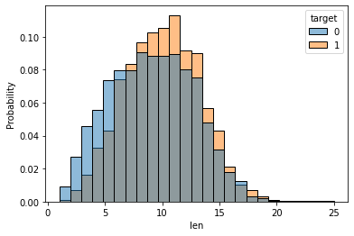
    


The tweets related to emergencies in the train dataset are considerably larger than the other tweets. To finish the data exokiration let's construct a word cloud for both categories.


```python
pos_words = list(itertools.chain(*data_train[data_train['target']==1]['text_processed'].values))
neg_words = list(itertools.chain(*data_train[data_train['target']==0]['text_processed'].values))
```


```python
word_cloud = WordCloud(
    background_color='White',
    height=500,
    width=800
)
```

Tweets related to disaster


```python
wc = word_cloud.generate_from_text(' '.join(pos_words))
wc.to_image()
```


    

    


Tweets not related to disaster


```python
wc = word_cloud.generate_from_text(' '.join(neg_words))
wc.to_image()
```


    

    


Words related to disaster like flood, fire, storm and death are very prominent in the positive word cloud. In the negative labelled tweets these words also appear, but are much smaller, implying that do not appear as often in the text.

## Modelling

For the modelling part of this project the evaluation metric of choice is the F1 score as it is the metric that is being used in the kaggle competition

### Data preparation

Let's split the train data into train and validation sets.


```python
X_train, X_cv, y_train, y_cv = train_test_split(
    data_train[['text_processed']],data_train['target'],
    test_size=0.2,
)
```

The tweets are now cleaned and transformed into arrays of standarized words, but machine learning models including RNNs require numerical attributes in order to work, so a last transformation of these list of words into numerical arrays is required. 

The first method we are going to use is the Term Frequency - Inverse Document Frequency vectorization technique. This method takes a tweet and produces a vector with the same length of the distinct words of the training data, where each component is proportional to the number of times that term appear in the tweet and is penalized for the amount of tweets containing the word. This technique does not take into account the order of the words and produces a single vector for each tweet, so the result will be used to train a random forest which will serve as a baseline for the neural networks.


```python
vectorizer = TfidfVectorizer()
```


```python
X_train_tfid = np.array(
    vectorizer.fit_transform(X_train["text_processed"].apply(lambda x: " ".join(x))).todense()
)
```


```python
X_cv_tfid = np.array(
    vectorizer.transform(X_cv["text_processed"].apply(lambda x: " ".join(x))).todense()
)
```

A couple of word embedings will also be used to produce sequences of vectors that can be inputed to Recurrent Neural Networks. The methods selected were Word2Vec and Glove. While Word2Vec relies on large neural networks trained on enormous corpuses of text in order to do feature selection, the Glove model is trained using matrix factorization techniques.


```python
word_2_vec = downloader.load('word2vec-google-news-300')
glove = downloader.load('glove-twitter-25')
```


```python
def vectorize(arr, vectorizer):
    r = None
    for a in arr:
        try:
            if r is None:
                r = np.array([vectorizer[a]])
            else:
                r = np.vstack([r,vectorizer[a]])
        except KeyError:
            pass
    if r is None:
        return np.array([])
    return r
```


```python
X_train['text_processed_glove'] = X_train['text_processed'].apply(lambda arr: vectorize(arr, glove))
X_train['text_processed_w2v'] = X_train['text_processed'].apply(lambda arr: vectorize(arr, word_2_vec))
X_cv['text_processed_glove'] = X_cv['text_processed'].apply(lambda arr: vectorize(arr, glove))
X_cv['text_processed_w2v'] = X_cv['text_processed'].apply(lambda arr: vectorize(arr, word_2_vec))
```


```python
data_test['text_processed_glove'] = data_test['text_processed'].apply(lambda arr: vectorize(arr, glove))
data_test['text_processed_w2v'] = data_test['text_processed'].apply(lambda arr: vectorize(arr, word_2_vec))
```

Keras RNNs require to have as input a matrix of dimensions (NumberOfTweetsInBatch, NumberOfWordsInTweet, WordEmbeddingDimension), but tweets do not have uniform length, so we in the next cells the numerical array representation of tweets will be padded with 0s so that every the shape of the representations of all tweets are the same.


```python
glove_len = len(X_train['text_processed_glove'].iloc[0][0])
w2v_len = len(X_train['text_processed_w2v'].iloc[0][0])
```


```python
def padArr(arr, arr_size, tot_size):
    if len(arr) == 0:
        return np.zeros((tot_size,arr_size))
    for i in range(len(arr),tot_size):
        arr = np.vstack([arr,np.zeros(arr_size)])
    return arr
def padSer(ser, arr_size):
    tot_size = ser.apply(len).max()
    return ser.apply(lambda arr: padArr(arr, arr_size, tot_size))
```


```python
X_train['text_processed_glove'] = padSer(X_train['text_processed_glove'],glove_len)
X_cv['text_processed_glove'] = padSer(X_cv['text_processed_glove'],glove_len)
X_train['text_processed_w2v'] = padSer(X_train['text_processed_w2v'],w2v_len)
X_cv['text_processed_w2v'] = padSer(X_cv['text_processed_w2v'],w2v_len)
```


```python
data_test['text_processed_glove'] = padSer(data_test['text_processed_glove'],glove_len)
data_test['text_processed_w2v'] = padSer(data_test['text_processed_w2v'],w2v_len)
```

### Random forest baseline


```python
def gen_rf_hyperparameters():
    n_estimators = max(int(10 ** (np.random.random() * 1.5 + 1)), 1)
    max_depth = np.random.choice([1, 2, 5, 10, 20])
    min_samples_leaf = np.random.randint(1, 100)
    max_features = np.random.random()
    return {
        "n_estimators": n_estimators,
        "max_depth": max_depth,
        "min_samples_leaf": min_samples_leaf,
        "max_features": max_features,
    }
```


```python
f1_score()
```


```python
n_cv = 10
score = 0
final_params = None
for i in range(n_cv):
    if i % 2 == 0:
        print(
            f"Iteration {i+1} - {n_cv}: CV - {datetime.datetime.today().strftime('%H:%M:%S')}"
        )
    params = gen_rf_hyperparameters()
    model = RandomForestClassifier(**params)
    model.fit(X_train_tfid,y_train)
    pred = model.predict(X_cv_tfid)
    cv_score = f1_score(y_cv,pred)
    if cv_score > score:
        score = cv_score
        final_params = params
        print(f"Iteration {i+1} - F1 score :{score}")
```

    Iteration 1 - 10: CV - 15:02:07
    Iteration 0 - F1 score :0.11299435028248588
    Iteration 1 - F1 score :0.1825503355704698
    Iteration 3 - 10: CV - 15:02:31
    Iteration 3 - F1 score :0.4757894736842105
    Iteration 5 - 10: CV - 15:04:03
    Iteration 7 - 10: CV - 15:05:11
    Iteration 9 - 10: CV - 15:05:31


The final F1 score for the random forest after cross validation was about 0.48 which leaves a lot of room for improvement. 

### RNNs


```python
early_stopping = keras.callbacks.EarlyStopping(monitor='val_loss', patience=20, restore_best_weights=True)
```

#### Glove SimpleRNN


```python
inputs = keras.layers.Input(shape=(None,glove_len), dtype = tf.float32)
x = keras.layers.Masking(mask_value=0., input_shape=(None, glove_len))(inputs)
x = keras.layers.SimpleRNN(10)(x)
outputs = keras.layers.Dense(1, activation='sigmoid')(x)
model_gs = keras.Model(inputs, outputs)
```


```python
model_gs.compile(
    optimizer=keras.optimizers.Adam(),
    loss=keras.losses.BinaryCrossentropy(),
    metrics=[keras.metrics.BinaryAccuracy(), keras.metrics.AUC()]
)
```


```python
model_gs.summary()
```

    Model: "model_3"
    _________________________________________________________________
     Layer (type)                Output Shape              Param #   
    =================================================================
     input_4 (InputLayer)        [(None, None, 25)]        0         
                                                                     
     masking_3 (Masking)         (None, None, 25)          0         
                                                                     
     simple_rnn_3 (SimpleRNN)    (None, 10)                360       
                                                                     
     dense_3 (Dense)             (None, 1)                 11        
                                                                     
    =================================================================
    Total params: 371
    Trainable params: 371
    Non-trainable params: 0
    _________________________________________________________________


```python
fit_hist_gs = model_gs.fit(
    x=np.stack(X_train['text_processed_glove']),
    y=y_train,
    validation_data=(np.stack(X_cv['text_processed_glove']), y_cv),
    batch_size=10000,
    epochs = 1000,
    callbacks=[early_stopping],
    verbose=0,
)
```

    2022-07-29 15:35:13.416632: I tensorflow/core/grappler/optimizers/custom_graph_optimizer_registry.cc:113] Plugin optimizer for device_type GPU is enabled.
    2022-07-29 15:35:14.155097: I tensorflow/core/grappler/optimizers/custom_graph_optimizer_registry.cc:113] Plugin optimizer for device_type GPU is enabled.


```python
plt.plot(fit_hist_gs.history['auc_3'][1:])
plt.plot(fit_hist_gs.history['val_auc_3'][1:])
```


    [<matplotlib.lines.Line2D at 0x444cbee90>]


    
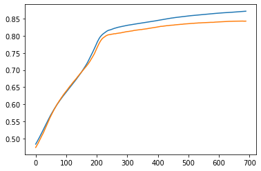
    


```python
plt.plot(fit_hist_gs.history['loss'][1:])
plt.plot(fit_hist_gs.history['val_loss'][1:])
```


    
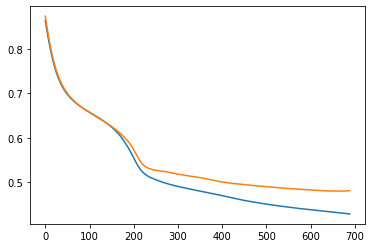
    


#### W2V SimpleRNN


```python
inputs = keras.layers.Input(shape=(None,w2v_len), dtype = tf.float32)
x = keras.layers.Masking(mask_value=0., input_shape=(None, w2v_len))(inputs)
x = keras.layers.SimpleRNN(10)(x)
outputs = keras.layers.Dense(1, activation='sigmoid')(x)
model_ws = keras.Model(inputs, outputs)
```


```python
model_ws.compile(
    optimizer=keras.optimizers.Adam(),
    loss=keras.losses.BinaryCrossentropy(),
    metrics=[keras.metrics.BinaryAccuracy(), keras.metrics.AUC()]
)
```


```python
model_ws.summary()
```

    Model: "model_4"
    _________________________________________________________________
     Layer (type)                Output Shape              Param #   
    =================================================================
     input_5 (InputLayer)        [(None, None, 300)]       0         
                                                                     
     masking_4 (Masking)         (None, None, 300)         0         
                                                                     
     simple_rnn_4 (SimpleRNN)    (None, 10)                3110      
                                                                     
     dense_4 (Dense)             (None, 1)                 11        
                                                                     
    =================================================================
    Total params: 3,121
    Trainable params: 3,121
    Non-trainable params: 0
    _________________________________________________________________


```python
fit_hist_ws = model_ws.fit(
    x=np.stack(X_train['text_processed_w2v']),
    y=y_train,
    validation_data=(np.stack(X_cv['text_processed_w2v']), y_cv),
    batch_size=10000,
    epochs = 1000,
    callbacks=[early_stopping],
    verbose=0,
)
```

    2022-07-29 15:54:38.742503: I tensorflow/core/grappler/optimizers/custom_graph_optimizer_registry.cc:113] Plugin optimizer for device_type GPU is enabled.
    2022-07-29 15:54:39.903579: I tensorflow/core/grappler/optimizers/custom_graph_optimizer_registry.cc:113] Plugin optimizer for device_type GPU is enabled.


```python
plt.plot(fit_hist_ws.history['auc_4'])
plt.plot(fit_hist_ws.history['val_auc_4'])
```


    
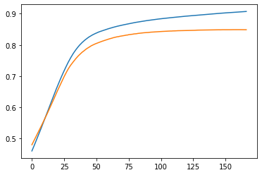
    


```python
plt.plot(fit_hist_ws.history['loss'])
plt.plot(fit_hist_ws.history['val_loss'])
```


    
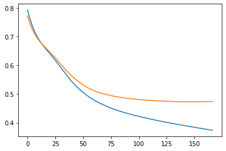
    


#### Glove LSTM


```python
inputs = keras.layers.Input(shape=(None,glove_len), dtype = tf.float32)
x = keras.layers.Masking(mask_value=0., input_shape=(None, glove_len))(inputs)
x = keras.layers.LSTM(10)(x)
outputs = keras.layers.Dense(1, activation='sigmoid')(x)
model_gl = keras.Model(inputs, outputs)
```


```python
model_gl.compile(
    optimizer=keras.optimizers.Adam(),
    loss=keras.losses.BinaryCrossentropy(),
    metrics=[keras.metrics.BinaryAccuracy(), keras.metrics.AUC()]
)
```


```python
model_gl.summary()
```

    Model: "model_5"
    _________________________________________________________________
     Layer (type)                Output Shape              Param #   
    =================================================================
     input_6 (InputLayer)        [(None, None, 25)]        0         
                                                                     
     masking_5 (Masking)         (None, None, 25)          0         
                                                                     
     lstm (LSTM)                 (None, 10)                1440      
                                                                     
     dense_5 (Dense)             (None, 1)                 11        
                                                                     
    =================================================================
    Total params: 1,451
    Trainable params: 1,451
    Non-trainable params: 0
    _________________________________________________________________


```python
fit_hist_gl = model_gl.fit(
    x=np.stack(X_train['text_processed_glove']),
    y=y_train,
    validation_data=(np.stack(X_cv['text_processed_glove']), y_cv),
    batch_size=10000,
    epochs = 1000,
    callbacks=[early_stopping],
    verbose=0,
)
```

    2022-07-29 15:57:06.826949: I tensorflow/core/grappler/optimizers/custom_graph_optimizer_registry.cc:113] Plugin optimizer for device_type GPU is enabled.
    2022-07-29 15:57:07.232243: W tensorflow/core/common_runtime/forward_type_inference.cc:231] Type inference failed. This indicates an invalid graph that escaped type checking. Error message: INVALID_ARGUMENT: expected compatible input types, but input 1:
    type_id: TFT_OPTIONAL
    args {
      type_id: TFT_PRODUCT
      args {
        type_id: TFT_TENSOR
        args {
          type_id: TFT_INT32
        }
      }
    }
     is neither a subtype nor a supertype of the combined inputs preceding it:
    type_id: TFT_OPTIONAL
    args {
      type_id: TFT_PRODUCT
      args {
        type_id: TFT_TENSOR
        args {
          type_id: TFT_FLOAT
        }
      }
    }
    
    	while inferring type of node 'cond_40/output/_23'
    2022-07-29 15:57:07.236385: I tensorflow/core/grappler/optimizers/custom_graph_optimizer_registry.cc:113] Plugin optimizer for device_type GPU is enabled.
    2022-07-29 15:57:07.627964: I tensorflow/core/grappler/optimizers/custom_graph_optimizer_registry.cc:113] Plugin optimizer for device_type GPU is enabled.
    2022-07-29 15:57:08.980503: I tensorflow/core/grappler/optimizers/custom_graph_optimizer_registry.cc:113] Plugin optimizer for device_type GPU is enabled.
    2022-07-29 15:57:09.207979: I tensorflow/core/grappler/optimizers/custom_graph_optimizer_registry.cc:113] Plugin optimizer for device_type GPU is enabled.


```python
plt.plot(fit_hist_gl.history['auc_5'])
plt.plot(fit_hist_gl.history['val_auc_5'])
```


    
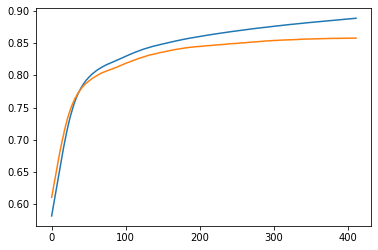
    


```python
plt.plot(fit_hist_gl.history['loss'])
plt.plot(fit_hist_gl.history['val_loss'])
```


    
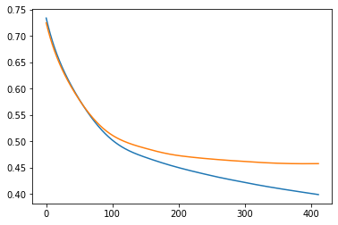
    


#### W2V LSTM


```python
inputs = keras.layers.Input(shape=(None,w2v_len), dtype = tf.float32)
x = keras.layers.Masking(mask_value=0., input_shape=(None, w2v_len))(inputs)
x = keras.layers.LSTM(10)(x)
outputs = keras.layers.Dense(1, activation='sigmoid')(x)
model_wl = keras.Model(inputs, outputs)
```


```python
model_wl.compile(
    optimizer=keras.optimizers.Adam(),
    loss=keras.losses.BinaryCrossentropy(),
    metrics=[keras.metrics.BinaryAccuracy(), keras.metrics.AUC()]
)
```


```python
model_wl.summary()
```

    Model: "model_6"
    _________________________________________________________________
     Layer (type)                Output Shape              Param #   
    =================================================================
     input_7 (InputLayer)        [(None, None, 300)]       0         
                                                                     
     masking_6 (Masking)         (None, None, 300)         0         
                                                                     
     lstm_1 (LSTM)               (None, 10)                12440     
                                                                     
     dense_6 (Dense)             (None, 1)                 11        
                                                                     
    =================================================================
    Total params: 12,451
    Trainable params: 12,451
    Non-trainable params: 0
    _________________________________________________________________


```python
fit_hist_wl = model_wl.fit(
    x=np.stack(X_train['text_processed_w2v']),
    y=y_train,
    validation_data=(np.stack(X_cv['text_processed_w2v']), y_cv),
    batch_size=10000,
    epochs = 1000,
    callbacks=[early_stopping],
    verbose=0,
)
```

    2022-07-29 16:02:48.981385: I tensorflow/core/grappler/optimizers/custom_graph_optimizer_registry.cc:113] Plugin optimizer for device_type GPU is enabled.
    2022-07-29 16:02:49.437144: I tensorflow/core/grappler/optimizers/custom_graph_optimizer_registry.cc:113] Plugin optimizer for device_type GPU is enabled.
    2022-07-29 16:02:50.006096: I tensorflow/core/grappler/optimizers/custom_graph_optimizer_registry.cc:113] Plugin optimizer for device_type GPU is enabled.
    2022-07-29 16:02:51.356340: I tensorflow/core/grappler/optimizers/custom_graph_optimizer_registry.cc:113] Plugin optimizer for device_type GPU is enabled.
    2022-07-29 16:02:51.592081: I tensorflow/core/grappler/optimizers/custom_graph_optimizer_registry.cc:113] Plugin optimizer for device_type GPU is enabled.


```python
plt.plot(fit_hist_wl.history['auc_6'])
plt.plot(fit_hist_wl.history['val_auc_6'])
```


    
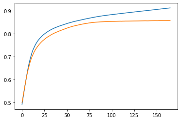
    


```python
plt.plot(fit_hist_wl.history['loss'])
plt.plot(fit_hist_wl.history['val_loss'])
```


    
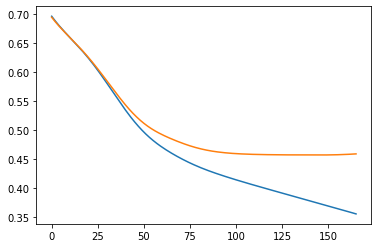
    


### Model comparison


```python
plt.plot(fit_hist_gs.history['val_loss'])
plt.plot(fit_hist_gl.history['val_loss'])
plt.plot(fit_hist_ws.history['val_loss'])
plt.plot(fit_hist_wl.history['val_loss'])
plt.legend([
    f'Glove simple {min(fit_hist_gs.history["val_loss"])}',
    f'Glove LSTM {min(fit_hist_gl.history["val_loss"])}',
    f'W2V simple {min(fit_hist_ws.history["val_loss"])}',
    f'W2V LSTM {min(fit_hist_wl.history["val_loss"])}',
])
fig = plt.gcf()
ax = plt.gca()
fig.set_size_inches(12,8)
ax.set_title('Binary entropy loss',size=30)
```


    
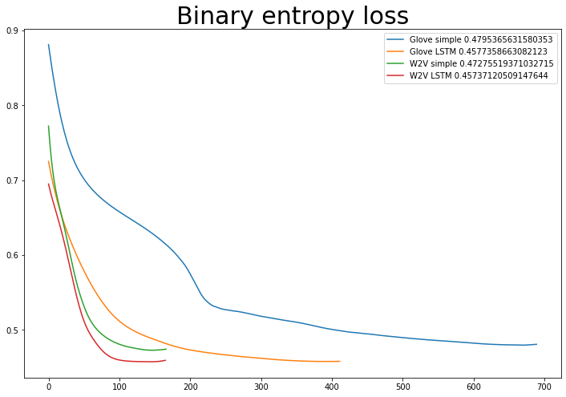
    


```python
plt.plot(fit_hist_gs.history['val_auc_3'])
plt.plot(fit_hist_gl.history['val_auc_5'])
plt.plot(fit_hist_ws.history['val_auc_4'])
plt.plot(fit_hist_wl.history['val_auc_6'])
plt.legend([
    f'Glove simple {max(fit_hist_gs.history["val_auc_3"])}',
    f'Glove LSTM {max(fit_hist_gl.history["val_auc_5"])}',
    f'W2V simple {max(fit_hist_ws.history["val_auc_4"])}',
    f'W2V LSTM {max(fit_hist_wl.history["val_auc_6"])}',
])
fig = plt.gcf()
fig.set_size_inches(12,8)
ax.set_title('AUC',size=30)
```


    
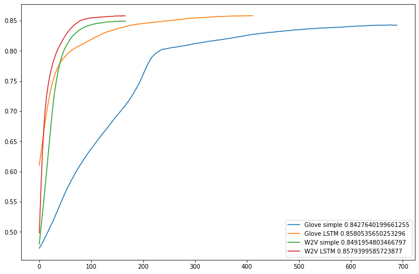
    


### Model refinement

callbacks


```python
early_stopping = keras.callbacks.EarlyStopping(monitor='val_loss', patience=20, restore_best_weights=True)
```

Cross validation one layer


```python
n_cv = 30
best_f1 = 0
best_model = None
fit_hists = []
for i in range(n_cv):
    print(
        f"Iteration {i+1} - {n_cv}: CV - {datetime.datetime.today().strftime('%H:%M:%S')}"
    )
    n_out = np.random.choice([2,5,10,20,50,100])
    dropout = np.random.random()*0.8
    #Model
    inputs = keras.layers.Input(shape=(None,w2v_len), dtype = tf.float32)
    x = keras.layers.Masking(mask_value=0., input_shape=(None, w2v_len))(inputs)
    x = keras.layers.LSTM(n_out, dropout=dropout)(x)
    outputs = keras.layers.Dense(1, activation='sigmoid')(x)
    model = keras.Model(inputs, outputs)
    model.compile(
        optimizer=keras.optimizers.Adam(),
        loss=keras.losses.BinaryCrossentropy(),
        metrics=[keras.metrics.BinaryAccuracy(), keras.metrics.AUC()]
    )
    #Fit
    fit_hists += [model.fit(
        x=np.stack(X_train['text_processed_w2v']),
        y=y_train,
        validation_data=(np.stack(X_cv['text_processed_w2v']), y_cv),
        batch_size=10000,
        epochs = 1000,
        callbacks=[early_stopping],
        verbose=0,
    )]
    f1_cv = f1_score(
        y_cv.values,
        (model.predict(np.stack(X_cv['text_processed_w2v'])).reshape(-1)>0.5).astype(int)
    )
    if f1_cv > best_f1:
        print(f"Iteration {i+1}, n_out: {n_out}, dropout: {dropout} - F1 score :{f1_cv}")
        best_f1 = f1_cv
        best_model = keras.models.clone_model(model)
        model.save('../data/model_final_1')
```

    Iteration 1 - 30: CV - 19:46:23
    Metal device set to: Apple M1 Max
    48/48 [==============================] - 1s 9ms/step
    Iteration 1, n_out: 2, dropout: 0.6961583802004631 - F1 score :0.7161345987920621


    WARNING:absl:Found untraced functions such as lstm_cell_layer_call_fn, lstm_cell_layer_call_and_return_conditional_losses while saving (showing 2 of 2). These functions will not be directly callable after loading.


    INFO:tensorflow:Assets written to: ../data/model_final_1/assets


    INFO:tensorflow:Assets written to: ../data/model_final_1/assets


    Iteration 2 - 30: CV - 19:58:24
    48/48 [==============================] - 1s 9ms/step
    Iteration 3 - 30: CV - 20:04:19
    48/48 [==============================] - 1s 10ms/step
    Iteration 4 - 30: CV - 20:06:57
    48/48 [==============================] - 1s 9ms/step
    Iteration 5 - 30: CV - 20:18:37
    48/48 [==============================] - 1s 10ms/step
    Iteration 6 - 30: CV - 20:20:20
    48/48 [==============================] - 2s 11ms/step
    Iteration 6, n_out: 100, dropout: 0.47652030571981724 - F1 score :0.7176616915422885


    WARNING:absl:Found untraced functions such as lstm_cell_6_layer_call_fn, lstm_cell_6_layer_call_and_return_conditional_losses while saving (showing 2 of 2). These functions will not be directly callable after loading.


    INFO:tensorflow:Assets written to: ../data/model_final_1/assets


    INFO:tensorflow:Assets written to: ../data/model_final_1/assets


    Iteration 7 - 30: CV - 20:22:12
    48/48 [==============================] - 1s 10ms/step
    Iteration 7, n_out: 50, dropout: 0.6831850287796712 - F1 score :0.7196495619524407


    WARNING:absl:Found untraced functions such as lstm_cell_8_layer_call_fn, lstm_cell_8_layer_call_and_return_conditional_losses while saving (showing 2 of 2). These functions will not be directly callable after loading.


    INFO:tensorflow:Assets written to: ../data/model_final_1/assets


    INFO:tensorflow:Assets written to: ../data/model_final_1/assets


    Iteration 8 - 30: CV - 20:23:59
    48/48 [==============================] - 1s 11ms/step
    Iteration 9 - 30: CV - 20:27:44
    48/48 [==============================] - 1s 11ms/step
    Iteration 10 - 30: CV - 20:29:16
    48/48 [==============================] - 1s 11ms/step
    Iteration 11 - 30: CV - 20:34:12
    48/48 [==============================] - 1s 11ms/step
    Iteration 11, n_out: 2, dropout: 0.10138255709643512 - F1 score :0.7238605898123325


    WARNING:absl:Found untraced functions such as lstm_cell_13_layer_call_fn, lstm_cell_13_layer_call_and_return_conditional_losses while saving (showing 2 of 2). These functions will not be directly callable after loading.


    INFO:tensorflow:Assets written to: ../data/model_final_1/assets


    INFO:tensorflow:Assets written to: ../data/model_final_1/assets


    Iteration 12 - 30: CV - 20:42:06
    48/48 [==============================] - 1s 12ms/step
    Iteration 13 - 30: CV - 20:43:42
    48/48 [==============================] - 1s 12ms/step
    Iteration 14 - 30: CV - 20:45:16
    48/48 [==============================] - 1s 12ms/step
    Iteration 14, n_out: 50, dropout: 0.7529244997034902 - F1 score :0.7517294388931591


    WARNING:absl:Found untraced functions such as lstm_cell_17_layer_call_fn, lstm_cell_17_layer_call_and_return_conditional_losses while saving (showing 2 of 2). These functions will not be directly callable after loading.


    INFO:tensorflow:Assets written to: ../data/model_final_1/assets


    INFO:tensorflow:Assets written to: ../data/model_final_1/assets


    Iteration 15 - 30: CV - 20:48:10
    48/48 [==============================] - 1s 12ms/step
    Iteration 15, n_out: 5, dropout: 0.7327413938920314 - F1 score :0.7532894736842105


    WARNING:absl:Found untraced functions such as lstm_cell_19_layer_call_fn, lstm_cell_19_layer_call_and_return_conditional_losses while saving (showing 2 of 2). These functions will not be directly callable after loading.


    INFO:tensorflow:Assets written to: ../data/model_final_1/assets


    INFO:tensorflow:Assets written to: ../data/model_final_1/assets


    Iteration 16 - 30: CV - 20:58:43
    48/48 [==============================] - 1s 12ms/step
    Iteration 17 - 30: CV - 21:07:58
    48/48 [==============================] - 1s 12ms/step
    Iteration 18 - 30: CV - 21:13:26
    48/48 [==============================] - 2s 12ms/step
    Iteration 19 - 30: CV - 21:17:39
    48/48 [==============================] - 1s 12ms/step
    Iteration 19, n_out: 20, dropout: 0.22073679154266257 - F1 score :0.7595118449389806


    WARNING:absl:Found untraced functions such as lstm_cell_24_layer_call_fn, lstm_cell_24_layer_call_and_return_conditional_losses while saving (showing 2 of 2). These functions will not be directly callable after loading.


    INFO:tensorflow:Assets written to: ../data/model_final_1/assets


    INFO:tensorflow:Assets written to: ../data/model_final_1/assets


    Iteration 20 - 30: CV - 21:19:47
    48/48 [==============================] - 1s 11ms/step
    Iteration 21 - 30: CV - 21:22:32
    48/48 [==============================] - 1s 12ms/step
    Iteration 22 - 30: CV - 21:24:25
    48/48 [==============================] - 1s 12ms/step
    Iteration 23 - 30: CV - 21:27:30
    48/48 [==============================] - 1s 13ms/step
    Iteration 24 - 30: CV - 21:29:23
    48/48 [==============================] - 1s 14ms/step
    Iteration 25 - 30: CV - 21:34:56
    48/48 [==============================] - 1s 14ms/step
    Iteration 26 - 30: CV - 21:45:09
    48/48 [==============================] - 1s 14ms/step
    Iteration 27 - 30: CV - 21:49:19
    48/48 [==============================] - 1s 15ms/step
    Iteration 28 - 30: CV - 21:58:56
    48/48 [==============================] - 1s 14ms/step
    Iteration 29 - 30: CV - 22:01:42
    48/48 [==============================] - 2s 15ms/step
    Iteration 30 - 30: CV - 22:03:18
    48/48 [==============================] - 2s 15ms/step


Cross validation including 2 layers


```python
n_cv = 30
best_f1 = 0
best_model = None
fit_hists = []
for i in range(n_cv):
    print(
        f"Iteration {i+1} - {n_cv}: CV - {datetime.datetime.today().strftime('%H:%M:%S')}"
    )
    n_out = np.random.choice([2,5,10,20,50,100])
    dropout = np.random.random()*0.8
    n_out_2 = np.random.choice([2,5,10,20,50,100])
    dropout_2 = np.random.random()*0.8
    #Model
    inputs = keras.layers.Input(shape=(None,w2v_len), dtype = tf.float32)
    x = keras.layers.Masking(mask_value=0., input_shape=(None, w2v_len))(inputs)
    x = keras.layers.LSTM(n_out, dropout=dropout, return_sequences=True)(x)
    x = keras.layers.LSTM(n_out_2, dropout=dropout_2)(x)
    outputs = keras.layers.Dense(1, activation='sigmoid')(x)
    model = keras.Model(inputs, outputs)
    model.compile(
        optimizer=keras.optimizers.Adam(),
        loss=keras.losses.BinaryCrossentropy(),
        metrics=[keras.metrics.BinaryAccuracy(), keras.metrics.AUC()]
    )
    #Fit
    fit_hists += [model.fit(
        x=np.stack(X_train['text_processed_w2v']),
        y=y_train,
        validation_data=(np.stack(X_cv['text_processed_w2v']), y_cv),
        batch_size=10000,
        epochs = 1000,
        callbacks=[early_stopping],
        verbose=0,
    )]
    f1_cv = f1_score(
        y_cv.values,
        (model.predict(np.stack(X_cv['text_processed_w2v'])).reshape(-1)>0.5).astype(int)
    )
    if f1_cv > best_f1:
        print(f"Iteration {i+1}, n: {n_out}, dout: {dropout}, n_2: {n_out_2}, dout_2: {dropout_2} - F1 score :{f1_cv}")
        best_f1 = f1_cv
        best_model = keras.models.clone_model(model)
        model.save('../data/model_final_2')
```

    Iteration 1 - 30: CV - 12:53:14
    48/48 [==============================] - 3s 21ms/step
    Iteration 1, n: 100, dout: 0.20275382700135902, n_2: 100, dout_2: 0.5963978117029418 - F1 score :0.7347480106100795


    WARNING:absl:Found untraced functions such as lstm_cell_4_layer_call_fn, lstm_cell_4_layer_call_and_return_conditional_losses, lstm_cell_5_layer_call_fn, lstm_cell_5_layer_call_and_return_conditional_losses while saving (showing 4 of 4). These functions will not be directly callable after loading.


    INFO:tensorflow:Assets written to: ../data/model_final_2/assets


    INFO:tensorflow:Assets written to: ../data/model_final_2/assets


    Iteration 2 - 30: CV - 12:56:40
    48/48 [==============================] - 3s 19ms/step
    Iteration 2, n: 2, dout: 0.016502276773062177, n_2: 2, dout_2: 0.7431641038563173 - F1 score :0.7530674846625767


    WARNING:absl:Found untraced functions such as lstm_cell_8_layer_call_fn, lstm_cell_8_layer_call_and_return_conditional_losses, lstm_cell_9_layer_call_fn, lstm_cell_9_layer_call_and_return_conditional_losses while saving (showing 4 of 4). These functions will not be directly callable after loading.


    INFO:tensorflow:Assets written to: ../data/model_final_2/assets


    INFO:tensorflow:Assets written to: ../data/model_final_2/assets


    Iteration 3 - 30: CV - 13:11:53
    48/48 [==============================] - 3s 18ms/step
    Iteration 4 - 30: CV - 13:16:54
    48/48 [==============================] - 2s 20ms/step
    Iteration 5 - 30: CV - 13:32:28
    48/48 [==============================] - 2s 20ms/step
    Iteration 6 - 30: CV - 13:37:23
    48/48 [==============================] - 2s 20ms/step
    Iteration 7 - 30: CV - 13:46:09
    48/48 [==============================] - 2s 20ms/step
    Iteration 7, n: 20, dout: 0.5252583844276464, n_2: 5, dout_2: 0.40937725937057573 - F1 score :0.75592960979342


    WARNING:absl:Found untraced functions such as lstm_cell_20_layer_call_fn, lstm_cell_20_layer_call_and_return_conditional_losses, lstm_cell_21_layer_call_fn, lstm_cell_21_layer_call_and_return_conditional_losses while saving (showing 4 of 4). These functions will not be directly callable after loading.


    INFO:tensorflow:Assets written to: ../data/model_final_2/assets


    INFO:tensorflow:Assets written to: ../data/model_final_2/assets


    Iteration 8 - 30: CV - 13:55:15
    48/48 [==============================] - 3s 21ms/step
    Iteration 9 - 30: CV - 14:10:29
    48/48 [==============================] - 2s 22ms/step
    Iteration 10 - 30: CV - 14:22:19
    48/48 [==============================] - 3s 22ms/step
    Iteration 10, n: 10, dout: 0.06017049657220408, n_2: 100, dout_2: 0.05865403474155837 - F1 score :0.7585206671501088


    WARNING:absl:Found untraced functions such as lstm_cell_28_layer_call_fn, lstm_cell_28_layer_call_and_return_conditional_losses, lstm_cell_29_layer_call_fn, lstm_cell_29_layer_call_and_return_conditional_losses while saving (showing 4 of 4). These functions will not be directly callable after loading.


    INFO:tensorflow:Assets written to: ../data/model_final_2/assets


    INFO:tensorflow:Assets written to: ../data/model_final_2/assets


    Iteration 11 - 30: CV - 14:26:47
    48/48 [==============================] - 2s 21ms/step
    Iteration 12 - 30: CV - 14:39:27
    48/48 [==============================] - 3s 23ms/step
    Iteration 12, n: 20, dout: 0.5968809531793224, n_2: 100, dout_2: 0.15737364430924697 - F1 score :0.7619749447310243


    WARNING:absl:Found untraced functions such as lstm_cell_34_layer_call_fn, lstm_cell_34_layer_call_and_return_conditional_losses, lstm_cell_35_layer_call_fn, lstm_cell_35_layer_call_and_return_conditional_losses while saving (showing 4 of 4). These functions will not be directly callable after loading.


    INFO:tensorflow:Assets written to: ../data/model_final_2/assets


    INFO:tensorflow:Assets written to: ../data/model_final_2/assets


    Iteration 13 - 30: CV - 14:46:19
    48/48 [==============================] - 3s 21ms/step
    Iteration 14 - 30: CV - 15:05:06
    48/48 [==============================] - 3s 27ms/step
    Iteration 15 - 30: CV - 15:09:57
    48/48 [==============================] - 4s 25ms/step
    Iteration 15, n: 5, dout: 0.08542173447338319, n_2: 2, dout_2: 0.4326245849039829 - F1 score :0.7651006711409396


    WARNING:absl:Found untraced functions such as lstm_cell_42_layer_call_fn, lstm_cell_42_layer_call_and_return_conditional_losses, lstm_cell_43_layer_call_fn, lstm_cell_43_layer_call_and_return_conditional_losses while saving (showing 4 of 4). These functions will not be directly callable after loading.


    INFO:tensorflow:Assets written to: ../data/model_final_2/assets


    INFO:tensorflow:Assets written to: ../data/model_final_2/assets


    Iteration 16 - 30: CV - 15:21:19
    48/48 [==============================] - 3s 25ms/step
    Iteration 17 - 30: CV - 15:27:49
    48/48 [==============================] - 3s 26ms/step
    Iteration 18 - 30: CV - 15:31:19
    48/48 [==============================] - 3s 27ms/step
    Iteration 19 - 30: CV - 15:35:38
    48/48 [==============================] - 3s 27ms/step
    Iteration 20 - 30: CV - 15:38:58
    48/48 [==============================] - 3s 27ms/step
    Iteration 21 - 30: CV - 15:43:58
    48/48 [==============================] - 3s 28ms/step
    Iteration 22 - 30: CV - 15:52:22
    48/48 [==============================] - 3s 28ms/step
    Iteration 23 - 30: CV - 16:00:31
    48/48 [==============================] - 3s 28ms/step
    Iteration 24 - 30: CV - 16:07:40
    48/48 [==============================] - 3s 28ms/step
    Iteration 25 - 30: CV - 16:19:27
    48/48 [==============================] - 3s 28ms/step
    Iteration 26 - 30: CV - 16:29:17
    48/48 [==============================] - 3s 28ms/step
    Iteration 27 - 30: CV - 16:33:12
    48/48 [==============================] - 3s 31ms/step
    Iteration 27, n: 5, dout: 0.5415552637175142, n_2: 100, dout_2: 0.6856265488403447 - F1 score :0.7738998482549317


    WARNING:absl:Found untraced functions such as lstm_cell_68_layer_call_fn, lstm_cell_68_layer_call_and_return_conditional_losses, lstm_cell_69_layer_call_fn, lstm_cell_69_layer_call_and_return_conditional_losses while saving (showing 4 of 4). These functions will not be directly callable after loading.


    INFO:tensorflow:Assets written to: ../data/model_final_2/assets


    INFO:tensorflow:Assets written to: ../data/model_final_2/assets


    Iteration 28 - 30: CV - 16:49:15
    48/48 [==============================] - 3s 27ms/step
    Iteration 29 - 30: CV - 16:57:35
    48/48 [==============================] - 3s 33ms/step
    Iteration 30 - 30: CV - 17:03:07
    48/48 [==============================] - 3s 31ms/step


The best model has 2 LSTM layers and achieve a F1_score of 0.77

### Best model


```python
best_pred = model.predict(np.stack(X_cv['text_processed_w2v'])).reshape(-1)
```

    48/48 [==============================] - 1s 17ms/step


```python
RocCurveDisplay.from_predictions(
    y_cv.values,
    best_pred,
    label=f"Validation ROC AUC:{round(roc_auc_score(y_cv.values, best_pred),3)}",
)
```


    
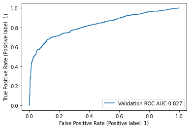
    


```python
ConfusionMatrixDisplay.from_predictions(
    y_cv.values,
    (best_pred>0.5).astype(int)
)
```


    
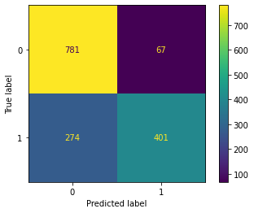
    


The confusion matrix and roc curve displayed are evidence of the predictive power of the model, and show that when a tweet is classified to have high probability of being about a disaster it almos certainly is. On the other hand, the model is not thorough enough to identify all tweets that are related to disasters.  


```python
best_pred_train = model.predict(np.stack(X_train['text_processed_w2v'])).reshape(-1)
```

    191/191 [==============================] - 6s 24ms/step


```python
f1_scores = []
best = 0
best_i = -1
for i in range(100):
    f1_scores += [f1_score(y_train, (best_pred_train>(i+1)/100).astype(int))]
    if f1_scores[-1] > best:
        best_i = i
        best = f1_scores[-1]
```


```python
plt.plot(f1_scores)
```


    
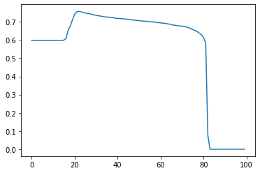
    


### Keras submission


```python
test_predictions = model.predict(np.stack(data_test['text_processed_w2v'])).reshape(-1)
```

    102/102 [==============================] - 2s 13ms/step


```python
test_results = pd.DataFrame(index=data_test.index,columns=['target'],data=test_predictions)
```


```python
test_results_save = test_results.copy()
```


```python
th = (best_i+1)/100
```


```python
test_results_save['target'] = test_results_save['target'].apply(lambda x: int(x>th))
```


```python
test_results_save.to_csv('../Data/kaggle_submission.csv')
```

## Conclusion

Using Keras a NLP model that can infer if a tweet is about a disaster or not was constructed. In the modelling process various word embeddings, model architechtures and hyperparameters were tested in order to find the model that gave the best reults. The resulting model has two LSTM layers followed by a dense layer used for prediction and achieved a f1 score of around 0.77. Some options for improving the results include refining the feature extraction process by trying other models like attention NNs and searching over more RNN architechtures.
